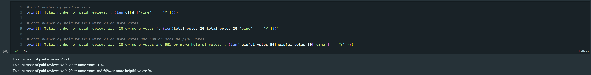

# Amazon Vine Analysis
 
# Overview
The purpose of this analysis is to determine if there is any bias toward favorable reviews from Vine members in the dataset using Python and the PySpark ETL process to extract the dataset, transform the data, connect to an AWS RDS instance, and load the transformed data into pgAdmin. The dataset used for this analysis is a subset of the Amazon Review dataset. The dataset contains reviews of various products from Amazon Vine members and non-members.

# Results
## How many Vine reviews and non-Vine reviews were there?

- Total number of Vine reviews: **4291**
- Total number of Vine reviews with 20 or more votes: **104**
- Total number of Vine reviews with 20 or more votes and 50% or more helpful votes: **94**

 

- Total number of non-Vine reviews: **1781706**
- Total number of non-Vine reviews with 20 or more votes: **65275**
- Total number of non-Vine reviews with 20 or more votes and 50% or more helpful votes: **40471**

## How many Vine reviews were 5 stars? How many non-Vine reviews were 5 stars?

- Total number of 5-star Vine reviews: **1607**
- Total number of 5-star Vine reviews with 20 or more votes: **48**
- Total number of 5-star Vine reviews with 20 or more votes and 50% or more helpful votes: **48**

 

- Total number of 5-star non-Vine reviews: **1025317**
- Total number of 5-star non-Vine reviews with 20 or more votes: **20439**
- Total number of 5-star non-Vine reviews with 20 or more votes and 50% or more helpful votes: **15663**

## What percentage of Vine reviews were 5 stars? What percentage of non-Vine reviews were 5 stars?

- Percentage of 5-star Vine reviews: **37.45%**
- Percentage of 5-star Vine reviews with 20 or more votes: **46.15%**
- Percentage of 5-star Vine reviews with 20 or more votes and 50% or more helpful votes: **51.06%**

 

- Percentage of 5-star non-Vine reviews: **57.54%**
- Percentage of 5-star non-Vine reviews with 20 or more votes: **31.31%**
- Percentage of 5-star non-Vine reviews with 20 or more votes and 50% or more helpful votes: **38.70%**

# Summary
Based on the results of the analysis,